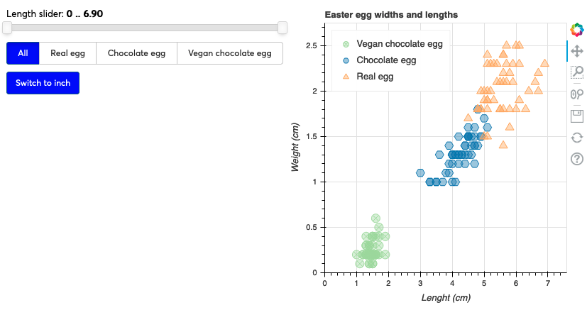

# Bokeh Demo


## Table of Content<a id='top'></a>

- [Introduction](#intro)
- [Interacive plots](#interactive)
- [How to get started](#get_started)
- [Data sources](#data)

## Introduction<a id='intro'></a>
[[back to top]](#top)



Bokeh is a Python library for creating interactive visualizations for modern web browsers. It helps you build beautiful graphics, ranging from simple plots to complex dashboards with streaming datasets. [[Bokeh documentation]](https://docs.bokeh.org/en/latest/)

Bokeh is named after the Japanese word 暈け (boke) for _blur_ or _haze_, used in photography to describe the aesthetic quality of the blur 
produced in out-of-focus parts of an image. [[Wikipedia]](https://en.wikipedia.org/wiki/Bokeh)

The Jupyter notebook [`Bokeh_introduction.ipynb`](https://github.com/nestauk/dap_tutorials/blob/main/bokeh_demo/code/Bokeh_introduction.ipynb) gives a brief intro to the basics of Bokeh, covering glyphs, tools, legends and basic scatter plots. For a more detailed introduction see [Bokeh First Steps](https://docs.bokeh.org/en/latest/docs/first_steps/first_steps_1.html).

Find a slide deck introducting Bokeh [here](https://docs.google.com/presentation/d/1fs2qsm4cGbDvxqZ0R-G1BeovI4XZeZn10zKYnQlADRY/edit#slide=id.g22b81162611_0_56).

## Interactive plots<a id='interactive'></a>
[[back to top]](#top)

Bokeh is ideal for creating interactive charts with widgets to adjust the data and plots. There are two ways to create an interactive Bokeh plot with widgets: you can use the Bokeh server or JavaScript custom callbacks. When using the Bokeh server, you can write your update function in pure python, but you're relying on the Bokeh server to host your visualisation. Using custom callbacks with JavaScript, you can create standalone HTML outputs that can easily be embedded in websites but you will need basic JavaScript knowledge.

To run your script with a bokeh server: `bokeh serve --show python_script.py`

To include a widget, follow these steps written up in pseudo code:

**1. Define widget**

```
radio_group = RadioGroup(labels=["Opt 1", "Opt 2", "Opt 3"], active=0)
```

**2. Connect widget to update function**

```
radio_group.js_on_change("active", update_funct/callback)
```

**3. Update function or custom JS callback**

```
def update_funct(attr, old, new):
	...

callback = CustomJS(args=dict(source=source),code= ...)
```

**4. Add widget to final output**

```
final_layout = row(radio_group, p)
```

Find complete Bokeh server examples here:

- [`01_slider.py`](https://github.com/nestauk/dap_tutorials/blob/main/bokeh_demo/code/01_slider.py)
- [`02_slider_and_buttons.py`](https://github.com/nestauk/dap_tutorials/blob/main/bokeh_demo/code/02_slider_and_buttons.py)
- [`03_switch_to_inch.py`](https://github.com/nestauk/dap_tutorials/blob/main/bokeh_demo/code/03_switch_to_inch.py)

Find a complete JS custom callback example here: [`interactive_easter_eggs.py`](https://github.com/nestauk/dap_tutorials/blob/main/bokeh_demo/code/interactive_easter_eggs.py)
You can try out this visualisation [here](https://nestauk.github.io/dap_tutorials/interactive_easter_eggs.html).


## How to get started<a id='get_started'></a>
[[back to top]](#top)

Clone or update repo

- ```git clone https://github.com/nestauk/dap_tutorials.git``` OR
- ```cd dap_tutorials``` and ```git pull``` 


Create and activate conda enviroment

```
conda create --name bokeh_demo --file bokeh_demo/requirements.txt
conda activate bokeh_demo
```

Prepare ipykernel

```
conda install -c anaconda ipykernel
python -m ipykernel install --user --name=bokeh_demo
```

Optional: Check whether the code runs properly

- `cd bokeh_demo/code`
- Run Bokeh_introduction.ipynb with Jupyter notebook
- Run `python interactive_easter_eggs.py`
- Run `bokeh serve --show 01_slider.py`


## Data sources<a id='data'></a>
[[back to top]](#top)

We provide two data sources with this tutorial:

- [`easter_eggs.csv`](https://github.com/nestauk/dap_tutorials/blob/main/bokeh_demo/data/easter_eggs.csv)
- [`reduced_epc.csv`](https://github.com/nestauk/dap_tutorials/blob/main/bokeh_demo/data/reduced_epc.csv)

The Easter egg data is actually the IRIS dataset adapted for the Easter holidays. Note that it does not actually reflect the size or nutrients of Easter eggs. ;-) 

The reduced EPC data represents a cleansed and enhanced version of [EPC records](https://www.google.com/url?q=https://epc.opendatacommunities.org/&sa=D&source=docs&ust=1680813102477902&usg=AOvVaw1A0upXwIfSO5Z9xGoN1Nxq) from Wales until September 2022, including the features `CURRENT_ENERGY_RATING`, `CONSTRUCTION_AGE_BAND`, `BUILT_FORM`, `PROPERTY_TYPE`, `HP_INSTALLED`, `HP_INSTALL_DATE`. This dataset is more suitable than the Easter egg set for creating Bokeh time series or bar charts.


